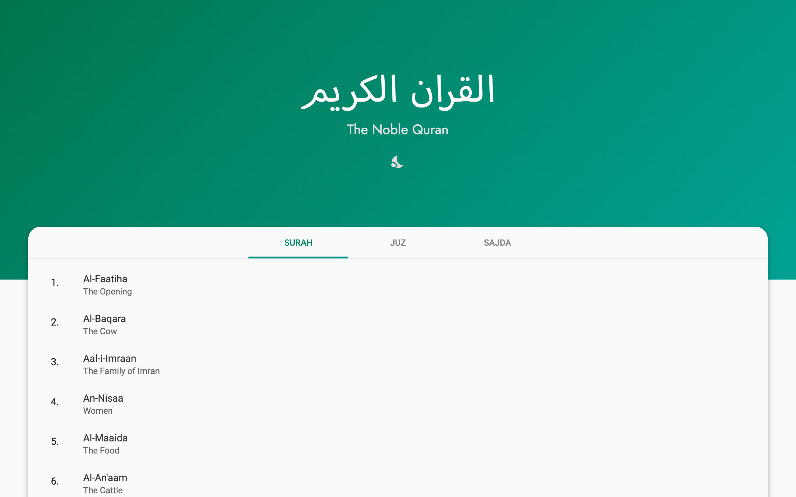
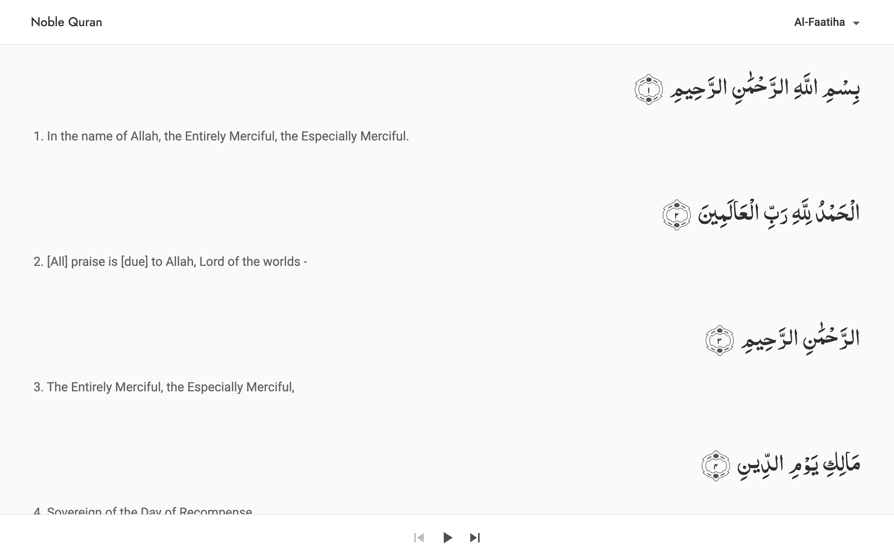

# The Noble Quran

Open Source Web App for reading Quran for free and without ads.

<!-- Screenshots Grid -->
<!-- 

  
  

 -->

<!-- 
 
 -->

# Contribution

Please feel free to fork and contribute to benefit everyone's experience.

# Want to start using now?

Project is available on [netlify.](https://noblequran.netlify.app)
